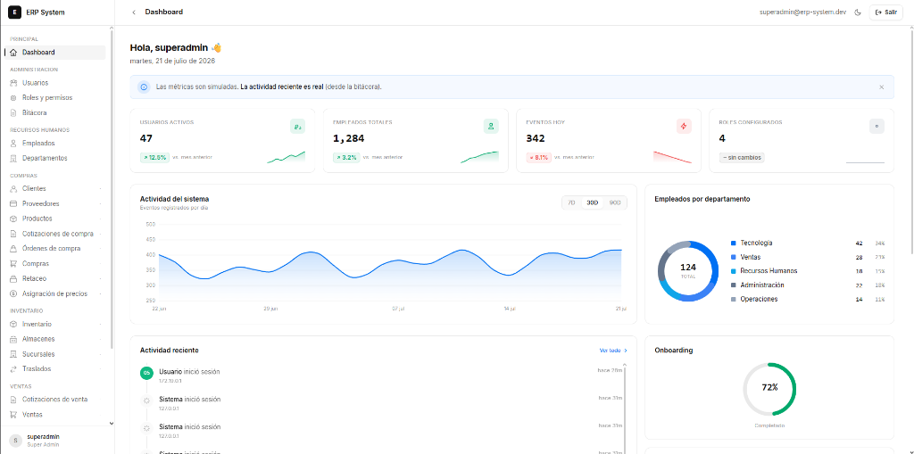
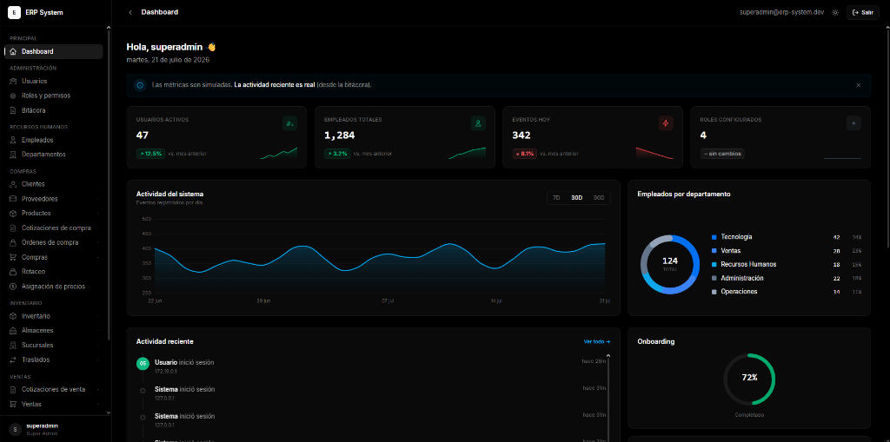

# ERP System — Boilerplate Empresarial

Sistema ERP modular construido con **FastAPI + SvelteKit 5 + PostgreSQL 16**.
Autenticación JWT con rotación de refresh tokens, RBAC dinámico administrable,
bitácora append-only, gestión de empleados y departamentos, dashboard con
gráficos, y 17 módulos futuros como mockups en el sidebar.

---

## Vista Previa

| Modo Claro | Modo Oscuro |
| :---: | :---: |
|  |  |

---

## Stack

| Layer       | Technology |
|-------------|------------|
| Backend     | Python 3.12, FastAPI (async), SQLAlchemy 2.0 async, Alembic, Pydantic v2, asyncpg, structlog, Argon2id, PyJWT |
| Frontend    | SvelteKit (Svelte 5 runes), TypeScript strict, TailwindCSS, Vitest, design system Geist (Vercel) |
| Database    | PostgreSQL 16 |
| Infra       | Docker, Docker Compose v2, Nginx (prod profile), Redis (optional profile) |
| Tooling     | `uv` (backend deps), `pnpm` (frontend deps), `make` |

---

## Quick start — un solo comando

Requisitos: **Docker** (con Compose v2) y **Git**. Nada más.

```bash
git clone <repo-url> erp-system && cd erp-system
make setup
```

O sin Make:

```bash
git clone <repo-url> erp-system && cd erp-system
# En macOS/Linux/Git Bash:
bash scripts/setup.sh
# En Windows PowerShell:
docker compose up -d --build
# luego esperar a que el backend esté healthy y ejecutar:
docker compose exec backend python -m seed.seed_data
```

`make setup` hace todo automáticamente:

1. Copia `.env.example` → `.env`
2. Construye y levanta los 3 contenedores (db, backend, frontend)
3. Espera a que Postgres esté healthy
4. Ejecuta migraciones Alembic automáticamente (al arrancar el backend)
5. Siembra la base de datos: catálogo de permisos, roles base, super-admin, 25 usuarios demo
6. Muestra las URLs y credenciales

### URLs

| Servicio           | URL |
|-------------------|-----|
| Frontend (Svelte) | http://localhost:5173 |
| Backend (FastAPI) | http://localhost:8000 |
| Swagger docs      | http://localhost:8000/docs |
| ReDoc docs        | http://localhost:8000/redoc |
| Postgres          | localhost:5432 |

### Credenciales semilla

| Campo | Valor |
|-------|-------|
| Usuario | `superadmin` |
| Contraseña | `Cambio!Seguro2026` |

> **Cambiar antes de producción.** Ver `.env` para `JWT_SECRET_KEY` y `POSTGRES_PASSWORD`.

25 usuarios demo adicionales con contraseña `Demo!Usuario2026`.

---

## Comandos comunes

```bash
make up              # levantar stack
make down            # detener stack
make logs            # ver logs
make ps              # estado de contenedores
make test            # todos los tests (backend + frontend)
make test-backend    # tests backend
make test-frontend   # tests frontend
make seed            # re-sembrar la base de datos
make reset-db        # wipe + migrar (destructivo)
make clean           # remover todo (contenedores, volúmenes, imágenes)
make lint            # lint backend + frontend
make prod-up         # levantar perfil producción (con Nginx)
```

---

## Estructura del proyecto

```
erp-system/
├── compose.yaml              # dev stack (db + backend + frontend)
├── compose.prod.yaml         # prod overlay (+ Nginx, non-root)
├── Makefile                  # targets: up/down/test/seed/reset-db/clean
├── .env.example              # template de variables de entorno
├── scripts/
│   ├── setup.sh              # un solo comando: build + migrate + seed
│   ├── seed.sh               # sembrar base de datos
│   ├── reset-db.sh           # wipe + migrar
│   └── run-tests.sh          # runner unificado de tests
├── docs/                     # arquitectura, schema DB, RBAC, API, design system
├── backend/                  # FastAPI (Clean / Hexagonal)
│   ├── Dockerfile            # multi-stage (dev + prod)
│   ├── pyproject.toml        # deps pinned, ruff, pytest, mypy
│   ├── alembic/              # migraciones versionadas (async)
│   ├── app/
│   │   ├── main.py           # app factory + lifespan (migraciones on startup)
│   │   ├── core/             # config, security, logging, exceptions
│   │   ├── domain/           # entidades + puertos (sin deps de framework)
│   │   ├── application/      # casos de uso (auth, users, rbac, employees, audit)
│   │   ├── infrastructure/   # DB engine, ORM models, repos concretos
│   │   ├── api/v1/           # routers + DTOs + deps + exception handlers
│   │   └── middlewares/      # security headers, request context, rate limit
│   ├── seed/                 # seed de permisos, roles, super-admin, demo
│   └── tests/                # unit (fakes) + integration + e2e (DB real)
├── frontend/                 # SvelteKit 5 (feature-sliced, Geist design)
│   ├── Dockerfile            # multi-stage (dev + prod, adapter-node)
│   ├── package.json          # pnpm, Svelte 5, Tailwind, Vitest
│   ├── src/
│   │   ├── app.html          # no-FOUC theme script
│   │   ├── app.css           # tokens Geist (claro/oscuro) + utilidades
│   │   ├── routes/           # login, dashboard, users, roles, employees, etc.
│   │   └── lib/
│   │       ├── api/          # cliente con interceptor refresh
│   │       ├── components/ui/  # Button, Card, Modal, Badge, Avatar, Sidebar
│   │       ├── features/dashboard/  # KpiCard, AreaChart, DonutChart, etc.
│   │       ├── stores/       # session, theme, permissions, search
│   │       └── navigation.ts # sidebar metadata (6 implementados + 17 mockups)
│   └── tests/                # vitest + testing-library
└── nginx/                    # reverse proxy para prod
```

---

## Seguridad

- Argon2id para contraseñas (configurable via env)
- JWT access (15 min) + refresh rotation con detección de reuso
- Rate limiting: login 10/min, refresh 30/min por IP
- Bloqueo progresivo tras 5 intentos fallidos
- `require_permission("code")` en cada endpoint sensible (deny-by-default)
- Cabeceras OWASP: CSP, X-Frame-Options, HSTS (prod), Referrer-Policy
- CORS restrictivo (nunca `*` con credenciales)
- Bitácora append-only (sin endpoints de UPDATE/DELETE)
- Ver `docs/architecture.md` para el mapeo OWASP A01-A10 completo

---

## Testing

```bash
make test              # 153 backend + 6 frontend = 159 tests
make test-backend      # pytest con coverage
make test-frontend     # vitest
```

- **Unit**: casos de uso con repositorios in-memory (sin DB)
- **Integration**: repositorios contra Postgres real
- **E2e**: flujos completos via httpx contra la app FastAPI
- Cobertura objetivo: ≥80% en `application/` y `domain/`

---

## Módulos implementados vs. futuros

| Módulo | Estado |
|--------|--------|
| Dashboard | ✅ Mockup premium con gráficos |
| Autenticación | ✅ Login/JWT/refresh/lockout |
| Usuarios | ✅ CRUD completo + filtros |
| Roles y permisos | ✅ RBAC dinámico + matriz |
| Empleados | ✅ CRUD + departamentos |
| Departamentos | ✅ Jerarquía con anti-ciclos |
| Bitácora | ✅ Append-only + paginación |
| Sidebar + tema | ✅ Geist design, claro/oscuro |
| Clientes, Proveedores, Productos, Compras, Ventas, Inventario, etc. (17) | Mockup en sidebar |

---

## Documentación

- `docs/architecture.md` — capas, ADRs, OWASP
- `docs/database-schema.md` — diagrama ER (Mermaid)
- `docs/rbac-model.md` — motor de permisos
- `docs/api.md` — endpoints y convenciones
- `docs/design-system.md` — tokens Geist

---

## Licencia

Proprietary — boilerplate for internal use.