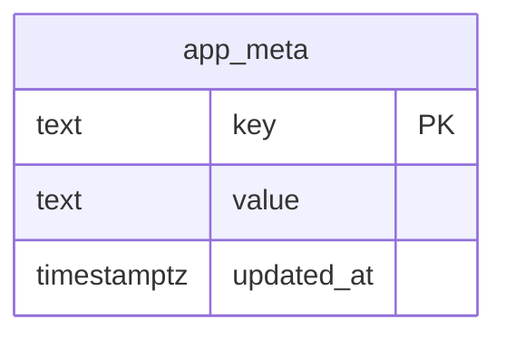
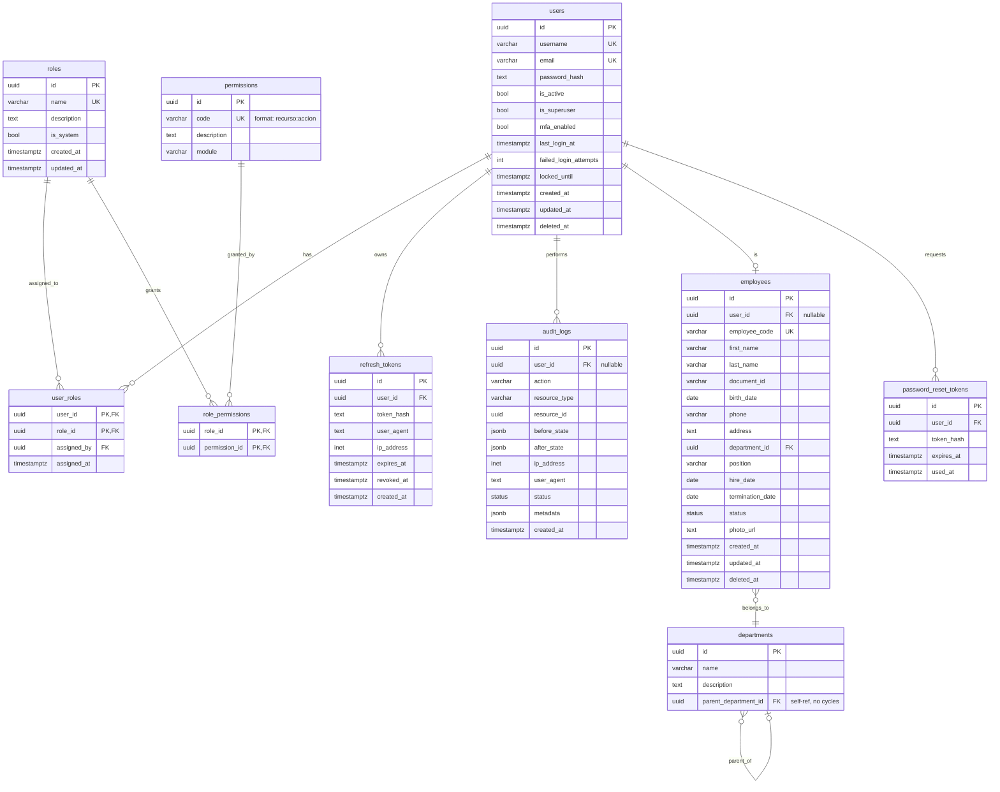

# Database Schema

> **Versión:** `v1.0.0` | **Última actualización:** `22/07/2026`  
> Complete schema design and conventions for PostgreSQL 16.

## 1. Conventions

- **Primary keys:** `UUID` (server-side `gen_random_uuid()`). No int autoincrement.
- **Timestamps:** `TIMESTAMPTZ` everywhere. `created_at` and `updated_at` on every
  entity; `deleted_at` for soft-delete on business entities.
- **Soft delete:** `users`, `employees`, `departments` use `deleted_at`. Hard
  delete is reserved for junction rows where history is captured elsewhere.
- **Naming:** snake_case tables and columns; constraints get stable names via
  Alembic autogenerate + manual review.
- **Audit log:** append-only (`INSERT` only); no `UPDATE`/`DELETE` API surface.

## 2. Phase 0 — current schema (Mermaid)

`app_meta` holds key/value markers (e.g. `schema_phase = 0`) and exists so
migrations are wired end-to-end and verifiable.

## 3. Target schema (Phases 1–4)

## 4. Indexes (target)

| Table | Column(s) | Type |
|-------|-----------|------|
| `users` | `email` | unique, btree |
| `users` | `username` | unique, btree |
| `employees` | `employee_code` | unique, btree |
| `audit_logs` | `created_at` | btree (DESC, for cursor pagination) |
| `audit_logs` | `user_id` | btree |
| `audit_logs` | `(resource_type, resource_id)` | composite btree |
| `refresh_tokens` | `token_hash` | unique, btree |
| `refresh_tokens` | `(user_id, revoked_at)` | partial where `revoked_at IS NULL` |

## 5. Migration policy

- One Alembic revision per logical change. Revisions are reversible
  (`downgrade()` implemented and tested).
- `compare_type` and `compare_server_default` are enabled so autogenerate
  catches type drift.
- Migrations run on container startup via the FastAPI lifespan hook (see
  ADR-003 in `architecture.md`). For production deploys with long-running
  migrations, decouple into an init container.
- `create_all()` is **dev/test only**; production always uses Alembic.